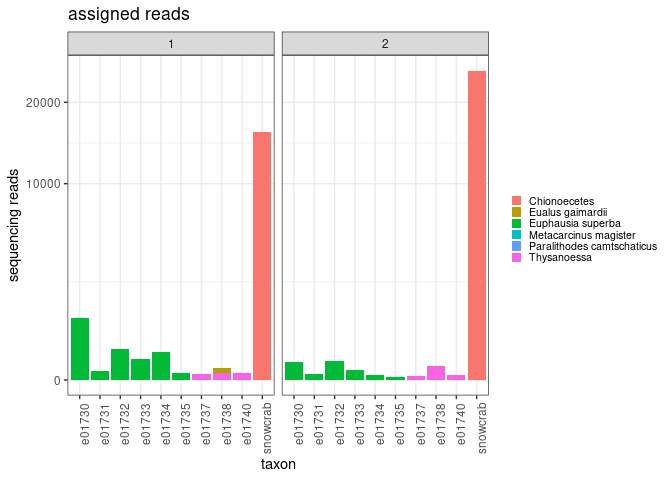
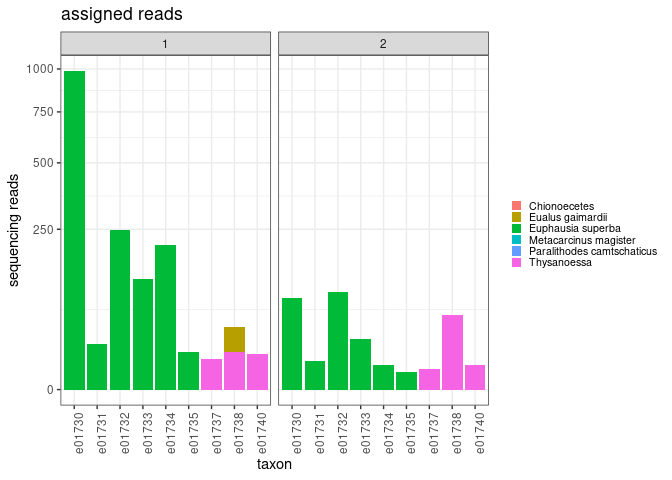
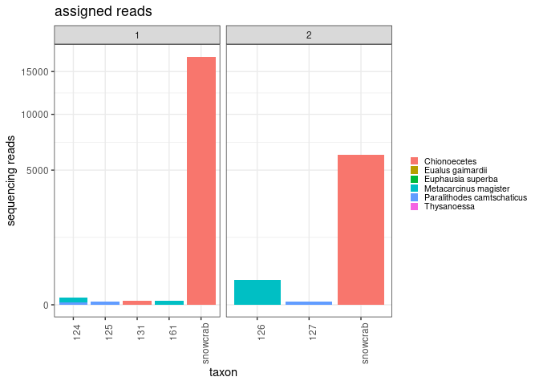
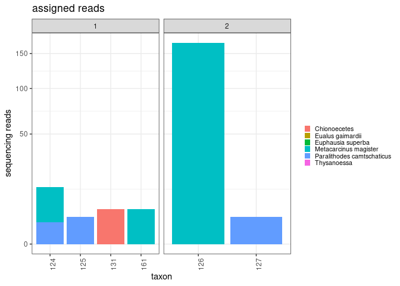

analysis of aquaria and near shore samples for decapods
================
Kimberly Ledger
2023-02-28

load libraries

``` r
library(tidyverse)
```

    ## ── Attaching packages ─────────────────────────────────────── tidyverse 1.3.2 ──
    ## ✔ ggplot2 3.4.0      ✔ purrr   0.3.5 
    ## ✔ tibble  3.1.8      ✔ dplyr   1.0.10
    ## ✔ tidyr   1.2.1      ✔ stringr 1.4.1 
    ## ✔ readr   2.1.3      ✔ forcats 0.5.2 
    ## ── Conflicts ────────────────────────────────────────── tidyverse_conflicts() ──
    ## ✖ dplyr::filter() masks stats::filter()
    ## ✖ dplyr::lag()    masks stats::lag()

``` r
library(ggplot2)
```

read in taxonomic identification table

``` r
taxons <- read.csv("/genetics/edna/workdir/crabs/20230216/trimmed/filtered/outputs/asv_taxonomy_blastn.csv", row.names = 1)
```

read in samples by asv table

``` r
asv_table <- read.csv("/genetics/edna/workdir/crabs/20230216/trimmed/filtered/outputs/ASVtable.csv") %>%
  rename(SampleID = X)
```

join taxon and asv table

``` r
read_summary <- asv_table %>%
  pivot_longer(cols = starts_with("ASV"), names_to = "ASV", values_to = "count") %>%
  left_join(taxons, by = "ASV") %>%
  filter(count > 0) %>%
  filter(taxon != "NA") %>%
  group_by(SampleID, taxon) %>%
  summarise(total_read_count = sum(count)) %>%
  pivot_wider(names_from = "taxon", values_from = "total_read_count") %>%
  replace(is.na(.), 0)
```

    ## `summarise()` has grouped output by 'SampleID'. You can override using the
    ## `.groups` argument.

pivot longer

``` r
read_summary <- read_summary %>%
  pivot_longer(cols = 2:7, names_to = "taxon", values_to = "reads") %>%
  mutate(reads = ifelse(is.na(reads), 0, reads))
```

SampleID’s contain all the relevant metadata so i’ll just work with that

``` r
read_summary <- read_summary %>%
  separate(SampleID, sep = "-", into =c("primer_set", "project", "sampleID", "replicate"))
```

## first, let’s look at the aquaria samples

note: six aquaria samples produced zero reads, and they are not included
in these figures. e01730 thru e01735 came from small aquaria, e01736 was
a negative control, and e01737 thru e01744 came from large aquarium.

``` r
aquaria <- read_summary %>%
  filter(project == "aquaria")
```

make some general plots for read counts  
here, replicate 1 is the library prep with 38 cycles for the amplicon
pcr and replicate 2 is the library prep with 45 cycles

``` r
aquaria %>%
  ggplot(aes(x= sampleID, y = reads, fill = taxon)) +
  geom_bar(stat = "identity") + 
  scale_y_sqrt() +
  facet_grid(~replicate, scales = 'free') + 
  theme_bw() +
  labs(
    y = "sequencing reads",
    x = "taxon",
    title = "assigned reads") + 
  theme(
    axis.text.x = element_text(angle = 90, hjust = 0.95),
    legend.text = element_text(size = 8),
    legend.key.size = unit(0.3, "cm"),
    legend.position = "right",
    legend.title = element_blank()
  )
```

<!-- -->

okay, lots of reads in the positive control. some krill and shrimp in
the aquarium samples. but no crabs asvs, even though crabs were present
in aquaria.

let’s make a plot that easier to see the read count

``` r
aquaria %>%
  filter(!sampleID == "snowcrab") %>%
  ggplot(aes(x= sampleID, y = reads, fill = taxon)) +
  geom_bar(stat = "identity") + 
  scale_y_sqrt() +
  facet_grid(~replicate, scales = 'free') + 
  theme_bw() +
  labs(
    y = "sequencing reads",
    x = "taxon",
    title = "assigned reads") + 
  theme(
    axis.text.x = element_text(angle = 90, hjust = 0.95),
    legend.text = element_text(size = 8),
    legend.key.size = unit(0.3, "cm"),
    legend.position = "right",
    legend.title = element_blank()
  )
```

<!-- -->

so increasing the PCR cycles did not seem to help here.

if we were to set some threshold for minimum read count, many of these
samples would not pass because read number is \<10.

in summary, two genera of krill were detected in the small and large
aquaria. it’s a bit odd that i did not pick up any of the hermit crabs
this run. i believe the 20230111 MiSeq run did.

## now, let’s look at the nearshore samples from Echo cove

``` r
nearshore <- read_summary %>%
  filter(project == "NS")
```

``` r
nearshore %>%
  ggplot(aes(x= sampleID, y = reads, fill = taxon)) +
  geom_bar(stat = "identity") + 
  scale_y_sqrt() +
  facet_grid(~replicate, scales = 'free') + 
  theme_bw() +
  labs(
    y = "sequencing reads",
    x = "taxon",
    title = "assigned reads") + 
  theme(
    axis.text.x = element_text(angle = 90, hjust = 0.95),
    legend.text = element_text(size = 8),
    legend.key.size = unit(0.3, "cm"),
    legend.position = "right",
    legend.title = element_blank()
  )
```

<!-- -->

and plot without the positive control

``` r
nearshore %>%
  filter(!sampleID == "snowcrab") %>%
  ggplot(aes(x= sampleID, y = reads, fill = taxon)) +
  geom_bar(stat = "identity") + 
  scale_y_sqrt() +
  facet_grid(~replicate, scales = 'free') + 
  theme_bw() +
  labs(
    y = "sequencing reads",
    x = "taxon",
    title = "assigned reads") + 
  theme(
    axis.text.x = element_text(angle = 90, hjust = 0.95),
    legend.text = element_text(size = 8),
    legend.key.size = unit(0.3, "cm"),
    legend.position = "right",
    legend.title = element_blank()
  )
```

<!-- -->

okay, so there were 20 samples from echo cove included in the library
prep. most had no identifiable reads. here, replicate 1 is the library
prep with 38 cycles for the amplicon pcr and replicate 2 is the library
prep with 45 cycles for the amplicon pcr.
